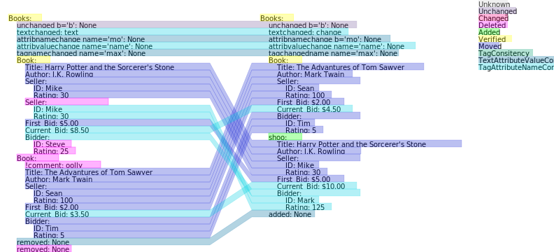

# XmlXdiff #
 - generating nice plots of differences between xml files
 - general comparison without grammatical information
 - playground for performance analysis
 - principle works
 
# Implementation #
 - creating an hashed tree representation of each element
 - each element is identified by it's xml path and a hash

|comparison results|test no|   |
|---|---|---|
|ElementUnchanged|test5|   |
|ElementAdded|test2|   |
|ElementDeleted|test4|   |
|ElementMoved|test5|   |
|ElementTagConsitency|test3|   |
|ElementTextAttributeValueConsitency|test7|   |
|ElementTagAttributeNameConsitency|test6|   |
|ElementChanged|   |   |
|ElementVerified|   |   |
|ElementUnknown|   |   |   |   |

<figure>
	
	<figcaption>example showing differences between xml's</figcaption>
</figure>

## To Be Investigated/Implemented
 - xdiff cost rating for moved and deleted leafs
 - gravity spline for moved elements
 - performance analysis and improvements (different hash algorithms, ...)
 - remove lxml path generation for more suitable paths (absolute tag[position]/tag[position]...
 - figure out how to create a general python package
 
# Inspired by xml-diff #
## Compare two XML files in unordered manner #

XML has been used to transfer hierarchical data. 
In most of those cases, the ordered relation between sibling 
nodes not important - only ancestor relation is important.

The [X-Diff](http://pages.cs.wisc.edu/~yuanwang/xdiff.html) algorithm 
describes how two XML documents can be effectively compared in an unordered
manner.

## License #
