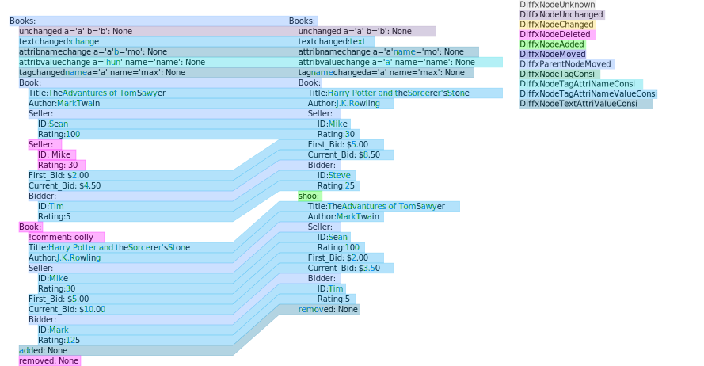
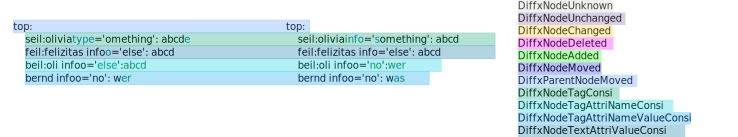
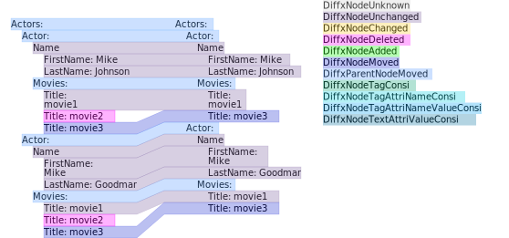
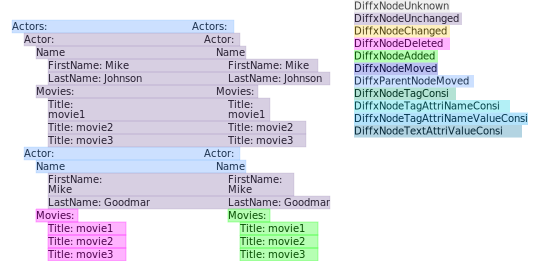
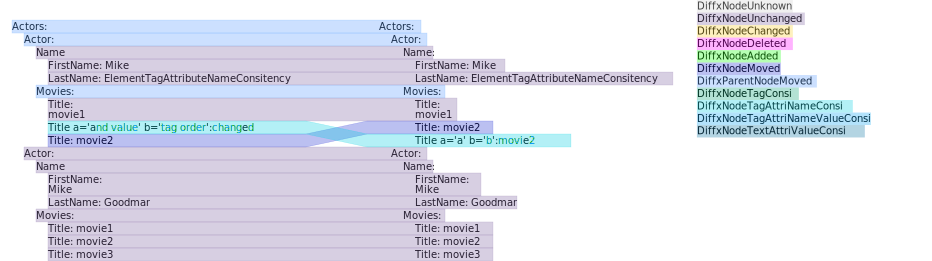
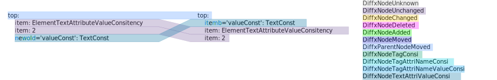
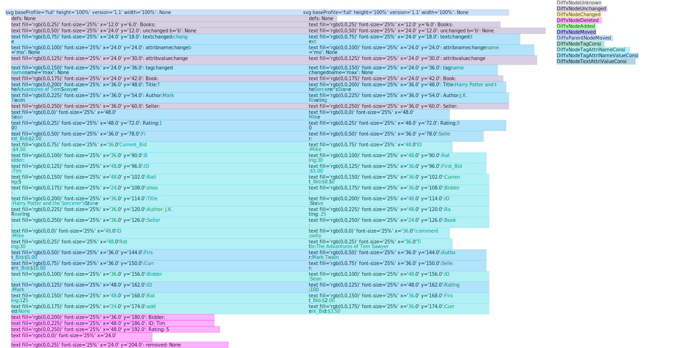

# Tests #

## Overview ##
|test focus|test available|test result|
|---|---|---|
|ElementUnchanged|test5|   |
|ElementAdded|test2|   |
|ElementDeleted|test4|   |
|ElementMoved|test5|   |
|ElementTagConsitency|test3|   |
|ElementTextAttributeValueConsitency|test7|   |
|ElementTagAttributeNameConsitency|test6|   |
|ElementChanged|   |   |
|ElementVerified|   |   |
|ElementUnknown|   |   |   |   |
|ElementWithNamespace|test8|   |   |   |

## Results ##

<figure>
	
</figure>

<figure>
	
</figure>

<figure>
	
</figure>

<figure>
	
</figure>

<figure>
	
</figure>

<figure>
	
</figure>

<figure>
	
</figure>

<figure>
	
</figure>

<figure>
	
</figure>

